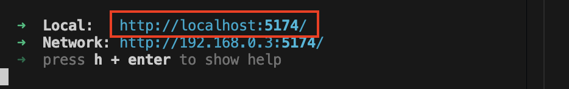

# skribh-demo-web-app
The locally-run web app used for product demonstration.

## Run The App Locally

The following commands need to be run in the root folder.

### Run the backend
- Run `make backend`

### Run the frontend
- In a new terminal run `make frontend`

The local host adress will appear in the terminal. It will take the form http://localhost:<port>.


Copy it and paste it into your browser to open the app.

## Run the Flask backend in Docker

### Run Skribh-api in Development Mode, and Map it to Port 5001:
- Run `make docker-backend`

### Run Skribh-api Container in Debug and Automatically SSH into the Container:
- Run `make ssh`

## Linting & Testing

### Run PyLint from Project Root:
- Run `make lint`

### Running Test Coverage from from Project Root:
- Run `make test`

### Troubleshooting
The Vite dev server proxies requests to 'api/' to the same port as the Flask server at route '/'. By default, the Flask server runs on port 5000, which may have conflicts on some systems.

For example, to run everything on port 8000:
- Run `flask run -p 8000` from /server
- Modify the port number in client/vite.config.js
    ```js
    proxy: {
        '/api': {
            // change port to 8000 here 👇🏽
            target: 'http://127.0.0.1:8000',
            changeOrigin: true,
            rewrite: (path) => path.replace(/^\/api/, ''), 
        },
    },
    ```